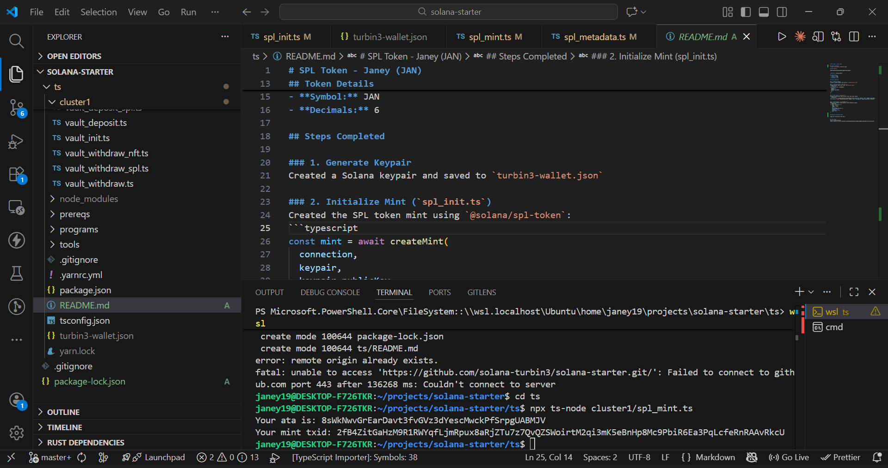

# SPL Token - Janey (JAN)

## Token Screenshot



## Mint Address

```
9V9P1Vkq4aeU7tmnEfcGnSZ99ivpWqSDFcsE5u21Bvhh
```

**Network:** Solana Devnet

## Token Details

- **Name:** Janey
- **Symbol:** JAN
- **Decimals:** 6

## Steps Completed

### 1. Generate Keypair

Created a Solana keypair and saved to `turbin3-wallet.json`

### 2. Initialize Mint (`spl_init.ts`)

Created the SPL token mint using `@solana/spl-token`:

```typescript
const mint = await createMint(connection, keypair, keypair.publicKey, null, 6);
```

### 3. Mint Tokens (`spl_mint.ts`)

Created an Associated Token Account (ATA) and minted tokens:

```typescript
const ata = await getOrCreateAssociatedTokenAccount(
  connection,
  keypair,
  mint,
  keypair.publicKey,
);
const mintTx = await mintTo(
  connection,
  keypair,
  mint,
  ata.address,
  keypair.publicKey,
  8444449,
);
```

### 4. Add Metadata (`spl_metadata.ts`)

Added token metadata using Metaplex Token Metadata program:

```typescript
let data: DataV2Args = {
  name: "Janey",
  symbol: "JAN",
  uri: "",
  sellerFeeBasisPoints: 0,
  creators: null,
  collection: null,
  uses: null,
};
```

## Minting Transaction Hash

Your ata is: 8sWkNwvGrEarDavt3fvGVz3dYescMwckPfSrpgUABMJV
Your mint txid: 2fB4ZitGaHzM9R1RWYqfLjmRpux8aRjZTu7z7QvQZSWoirtM2qi3mK5eBnHp8Mc9PbiR6Ea3PqLcfeRnRAAvRkcU

## View Token

View on Solana Explorer:
https://explorer.solana.com/address/9V9P1Vkq4aeU7tmnEfcGnSZ99ivpWqSDFcsE5u21Bvhh?cluster=devnet

# NFT Minting


NFT tx:
https://explorer.solana.com/tx/3StXUDgmwx4nW5KGy7zCsuYCgbXGWwHm7AMDCfYpoWWuprvc67QpEbStvBCBqMYQVxqcr1xUXP6yG2ityny5iMUm?cluster=devnet

Mint Address: BDHCKwaQCsHAgYjjyxtrFDAUvcQ6ejnHLeo51WT2iZMq

Transfer txid: 2g8qmSHbc64U62AJ8DmcPNTCzTW4ixFFLs5XN9SP66jUEwxpHW1raF5eBcEUSiqwyt6mp97rhRQnwsoVCdHxv8kS

# Problems with transferring nft using cli

1. Technical complexity
   Transferring NFTs via CLI or code requires knowledge of wallets, mint addresses, and token accounts. Mistakes can lead to lost NFTs.

2. No marketplace or automated payment
   Transfers are peer-to-peer only. You can’t sell, auction, or enforce payments automatically.

3. SOL fees and wallet requirements
   Every transfer requires SOL for transaction fees, and the recipient must have a token account to receive the NFT.

# Solutions

1. Use a wallet or frontend (e.g., Phantom)
   Simplifies transfers, reduces errors, and automatically handles token accounts.

2. Build helper functions or smart contracts
   Programmatically check ownership, validate recipients, and optionally enforce royalties or escrow.

3. Integrate marketplaces or batch transfer contracts
   Allows multiple transfers, auctions, or sales without manually sending each NFT and ensures secure payment flow.
